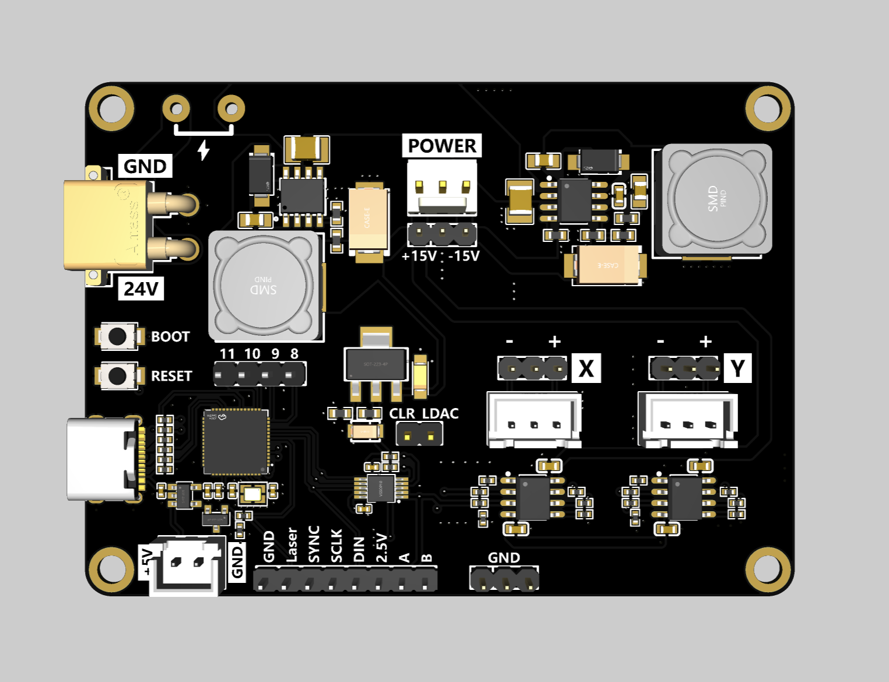
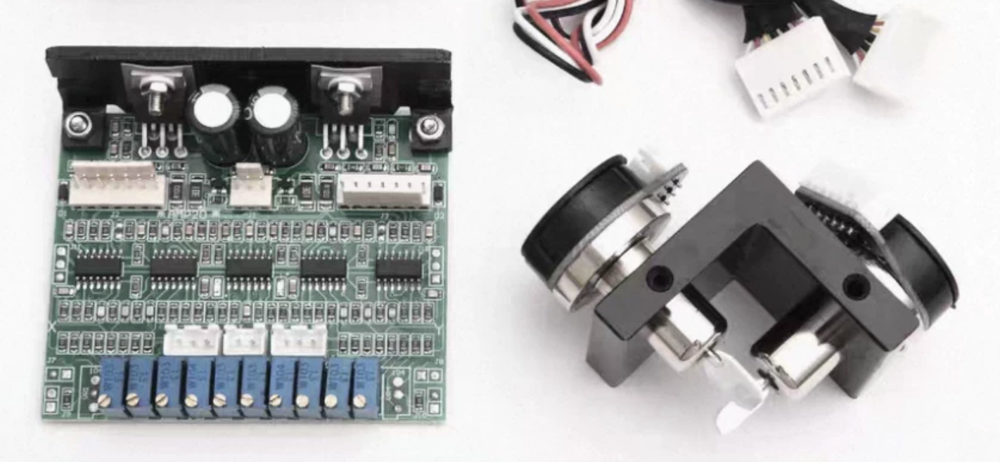
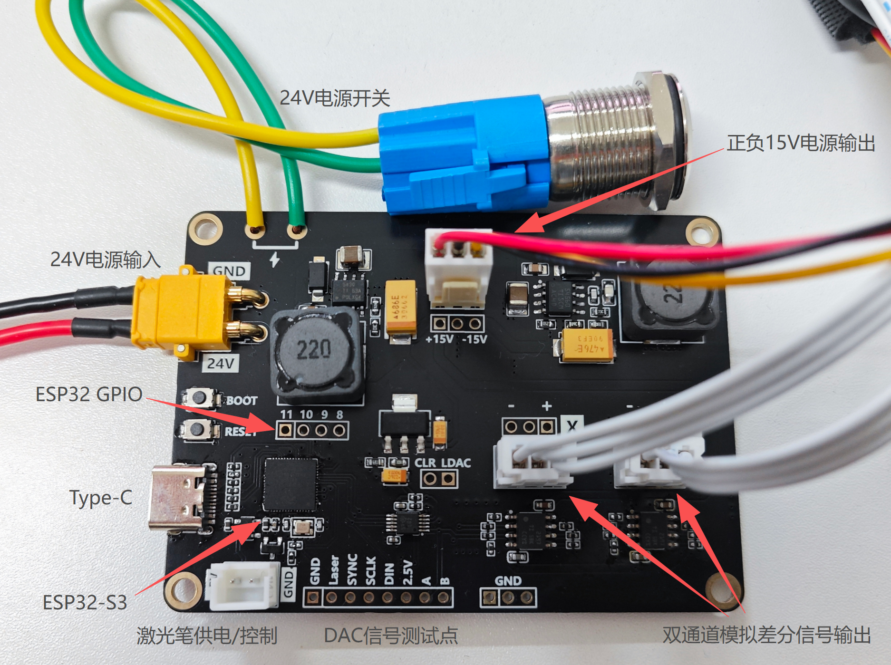
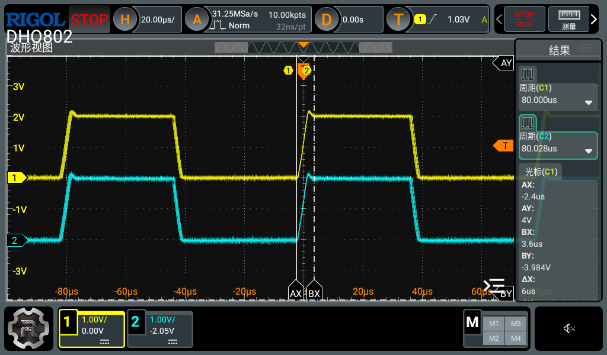

# GalvoBridge-ESP32：振镜双电源与数模转换一体化接口板

立创开源平台链接：[振镜双电源与数模转换一体化接口板 - 立创开源硬件平台](https://oshwhub.com/zoushui/project_hrrvwklm)

效果演示：[【开源】振镜驱动效果演示](https://www.bilibili.com/video/BV1rFKG6pEkv/?p=2&share_source=copy_web&vd_source=b9a966f3c62fa9746bb00910b5fc0d9c)

## 项目简介

**GalvoBridge-ESP32** 是一款专为模拟激光振镜系统设计的**一体化信号与电源适配接口板**。它集成了24V转±15V的**双电源转换模块** 与 **数字信号转模拟差分信号调理电路**，并集成了激光笔电源接口。

该项目旨在解决数字系统与模拟振镜系统之间的电压与信号鸿沟，实现一根 USB 线、一个24V电源即可轻松玩转振镜。

## 为什么会有这个项目？

在进行激光打标、激光投影相关的 DIY 开发时，市售的振镜电机通常会成套附带一块原厂伺服驱动板（见下图）：

然而，在实际使用中，原厂驱动板存在两个“高门槛”：

1. **供电苛刻：** 振镜驱动板通常需要特殊的**±15V双电源**供电。在大多数整机系统中，标准电源都是单24V，额外配置一个体积庞大的双电源开关电源既增加成本又占地方。

2. **信号不匹配：** 振镜驱动板只接收**±5V的模拟差分信号**来控制振镜。单片机或DAC无法直接提供匹配的信号。

本项目解决了上述痛点。

## 实现原理

* **高负载双电源方案**：采用两颗高效率 DCDC 电源芯片，将整机常用的单路+24V电源分别转换为高电流能力的+15V和-15V双电源，直接为振镜伺服系统供电。

* **数模转换与信号调理**：核心主控采用 **ESP32-S3**，通过 USB 串口接收上位机数字指令并进行解析。控制高性能双通道 DAC 芯片输出高精度模拟信号，再经过运算放大器进行**电平平移（偏置）、幅度放大以及差分化处理**，最终输出±5V幅值的模拟差分信号。

## 详细参数

| 项目       | 参数                                             |
| -------- | ---------------------------------------------- |
| 电源输入     | +24V（XT30接口）；+5V（Type-C接口）                     |
| 双电源输出    | ±15V（KF2510接口，3Pin，每路峰值 3A）                    |
| 差分信号输出   | XH2.54接口，幅值 -5V ~ +5V，最高 25k points/s（双通道同步输出） |
| 激光笔供电/控制 | XH2.54接口，5V，NMOS 驱动                            |

> 上图为在25k points/s的输出速率下，以2V为阶跃步长测试DAC输出，测得建立时间≤6us，抖动<2us，完全满足市售25k振镜的最高工作速率。

## Q&A：

Q: 为什么使用成本较高的ESP32-S3？

A: 因为ESP32-S3主频高，开发环境自带Free RTOS，完全满足25K points/s的打点速率。当然也可以不用ESP32：预留了DAC的SPI接口以及两个通道的输出信号的测试排针，用开发板连接排针一样可以驱动DAC。

Q: 为什么振镜不响应串口指令？

A: 检查两个通道是否按期望值输出、检查DAC通讯是否正常、检查DAC和运放电源是否正常、检查单片机是否正常工作。 另外，**24V和5V的上电顺序**也需要注意：请确保24V先于5V上电，或两者同时上电后再复位一次ESP32，否则DAC在上电时未就绪将导致初始化失败。
